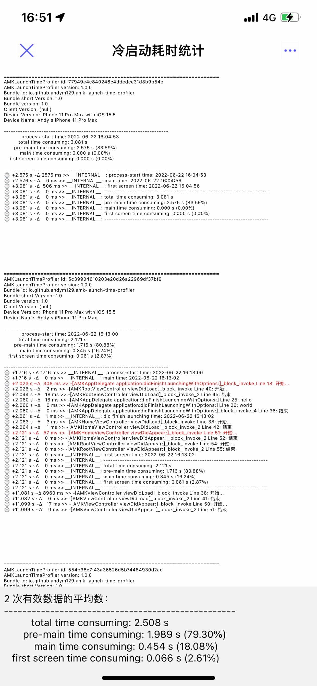
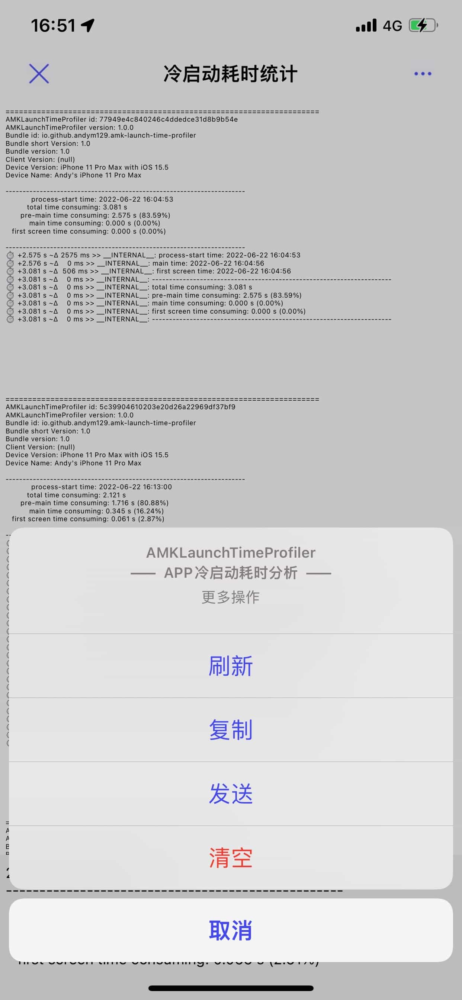
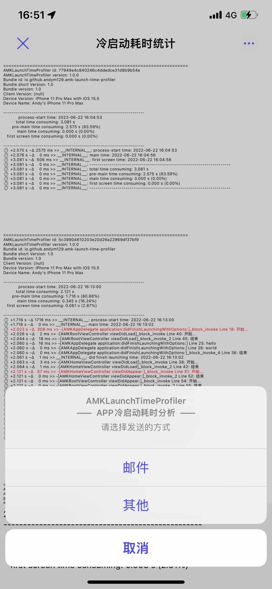
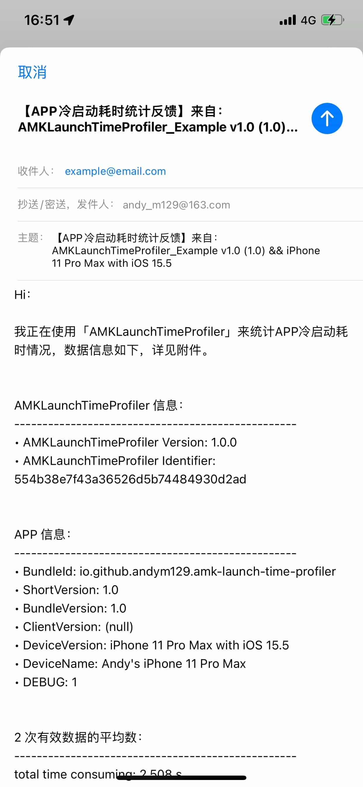
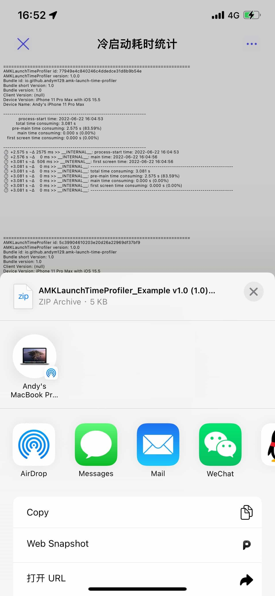

# AMKLaunchTimeProfiler <br/>—— 简单、易用、强大的 iOS APP 冷启动耗时分析工具

[](https://travis-ci.org/mengxinxin/AMKLaunchTimeProfiler)
[](https://cocoapods.org/pods/AMKLaunchTimeProfiler)
[](https://cocoapods.org/pods/AMKLaunchTimeProfiler)
[](https://cocoapods.org/pods/AMKLaunchTimeProfiler)

## 1、Features

* **零成本使用：** 通过 CocoaPods 一行代码接入，即可实现 APP 冷启动耗时统计，包括 `pre-main`、`main`、`首屏渲染`三个阶段的耗时，及总耗时

* **可视化查看：** 内置日志查看页面，并自动高亮高耗时方法，各种信息一目了然

* **源数据导出：** 可以方便的通过邮件、AirDrop 等方式 导出全部数据，具体包括

	* 日志列表的文本数据，方便在电脑上查看

	* 日志的JSON数据，方便基于日志的执行时间、调用方法、执行耗时 等信息 做自定义分析

	* 多次有效数据的平均数 数据

|  |  |  |  |  |
| ------------------------------------------------------------ | ------------------------------------------------------------ | ------------------------------------------------------------ | ------------------------------------------------------------ | ------------------------------------------------------------ |
| 可视化查看                                                   | 操作选项                                                     | 源数据导出                                                   | 通过邮件导出                                                 | 通过其他方式导出                                             |


## 2、Installation

`AMKLaunchTimeProfiler` 可通过[CocoaPods](https://cocoapods.org)完成引入，仅需现在工程的`Podfile`文件中 添加如下代码

```
pod 'AMKLaunchTimeProfiler'
```

然后在终端在`Podfile`文件所在路径下执行 `pod install`命令即可完成源码下载与引入。


## 3、Usage

### 3.1、查看相关日志

内置日志查看页面，并自动高亮高耗时方法，各种信息一目了然，具体可通过如下方式打开：


#### 3.1.1、使用手势

通过 `AMKLaunchTimeProfiler.debugEnable = YES;` 启用调试模式（默认不启用），即可在 任意界面，通过「双指从右向左轻扫」的手势打开


#### 3.1.2、使用编码

通过 `[AMKLaunchTimeProfilerLogsViewController.new presentingWithAnimated:YES completion:nil];` 使用代码打开


每一次启动，都会新创建 并保存一个 `AMKLaunchTimeProfiler` 实例，相关日志也都会存在该实例中，并实时持久化到本地，举例如下：

```
======================================================================
AMKLaunchTimeProfiler id: 5c39904610203e20d26a22969df37bf9
AMKLaunchTimeProfiler version: 1.0.0
Bundle id: io.github.andym129.amk-launch-time-profiler
Bundle short Version: 1.0
Bundle version: 1.0
Client Version: (null)
Device Version: iPhone 11 Pro Max with iOS 15.5
Device Name: Andy's iPhone 11 Pro Max

----------------------------------------------------------------------
            process-start time: 2022-06-22 16:13:00
          total time consuming: 2.121 s 
       pre-main time consuming: 1.716 s (80.88%)
           main time consuming: 0.345 s (16.24%)
   first screen time consuming: 0.061 s (2.87%)

----------------------------------------------------------------------
⏱ +1.716 s ~Δ 1716 ms >> __INTERNAL__: process-start time: 2022-06-22 16:13:00
⏱ +1.716 s ~Δ    0 ms >> __INTERNAL__: main time: 2022-06-22 16:13:02
⏱ +2.023 s ~Δ  308 ms >> -[AMKAppDelegate application:didFinishLaunchingWithOptions:]_block_invoke Line 18: 开始...
⏱ +2.026 s ~Δ    2 ms >> -[AMKRootViewController viewDidLoad]_block_invoke Line 40: 开始...
⏱ +2.044 s ~Δ   18 ms >> -[AMKRootViewController viewDidLoad]_block_invoke_2 Line 45: 结束
⏱ +2.060 s ~Δ   16 ms >> -[AMKAppDelegate application:didFinishLaunchingWithOptions:] Line 25: hello
⏱ +2.060 s ~Δ    0 ms >> -[AMKAppDelegate application:didFinishLaunchingWithOptions:] Line 26: world
⏱ +2.060 s ~Δ    0 ms >> -[AMKAppDelegate application:didFinishLaunchingWithOptions:]_block_invoke_4 Line 36: 结束
⏱ +2.061 s ~Δ    1 ms >> __INTERNAL__: did finish launching time: 2022-06-22 16:13:02
⏱ +2.063 s ~Δ    3 ms >> -[AMKHomeViewController viewDidLoad]_block_invoke Line 38: 开始...
⏱ +2.064 s ~Δ    1 ms >> -[AMKHomeViewController viewDidLoad]_block_invoke_2 Line 42: 结束
⏱ +2.121 s ~Δ   57 ms >> -[AMKHomeViewController viewDidAppear:]_block_invoke Line 51: 开始...
⏱ +2.121 s ~Δ    0 ms >> -[AMKHomeViewController viewDidAppear:]_block_invoke_2 Line 52: 结束
⏱ +2.121 s ~Δ    0 ms >> -[AMKRootViewController viewDidAppear:]_block_invoke Line 54: 开始...
⏱ +2.121 s ~Δ    0 ms >> -[AMKRootViewController viewDidAppear:]_block_invoke_2 Line 55: 结束
⏱ +2.121 s ~Δ    0 ms >> __INTERNAL__: first screen time: 2022-06-22 16:13:02
⏱ +2.121 s ~Δ    0 ms >> __INTERNAL__: ----------------------------------------------------------------------
⏱ +2.121 s ~Δ    0 ms >> __INTERNAL__: total time consuming: 2.121 s
⏱ +2.121 s ~Δ    0 ms >> __INTERNAL__: pre-main time consuming: 1.716 s (80.88%)
⏱ +2.121 s ~Δ    0 ms >> __INTERNAL__: main time consuming: 0.345 s (16.24%)
⏱ +2.121 s ~Δ    0 ms >> __INTERNAL__: first screen time consuming: 0.061 s (2.87%)
⏱ +2.121 s ~Δ    0 ms >> __INTERNAL__: ----------------------------------------------------------------------
⏱ +11.081 s ~Δ 8960 ms >> -[AMKViewController viewDidLoad]_block_invoke Line 38: 开始...
⏱ +11.082 s ~Δ    0 ms >> -[AMKViewController viewDidLoad]_block_invoke_2 Line 41: 结束
⏱ +11.099 s ~Δ   17 ms >> -[AMKViewController viewDidAppear:]_block_invoke Line 50: 开始...
⏱ +11.099 s ~Δ    0 ms >> -[AMKViewController viewDidAppear:]_block_invoke_2 Line 51: 结束
```


### 3.2、导出日志

在日志查看页面，点击右上角的“···”，点击发送，即可选择“邮件”或“其他”方式导出，具体包括：

####  3.2.1、AMKLaunchTimeProfiler_554b38e7f43a36526d5b74484930d2ad.log

```
======================================================================
AMKLaunchTimeProfiler id: 77949e4c840246c4ddedce31d8b9b54e
AMKLaunchTimeProfiler version: 1.0.0
Bundle id: io.github.andym129.amk-launch-time-profiler
Bundle short Version: 1.0
Bundle version: 1.0
Client Version: (null)
Device Version: iPhone 11 Pro Max with iOS 15.5
Device Name: Andy's iPhone 11 Pro Max

----------------------------------------------------------------------
            process-start time: 2022-06-22 16:04:53
          total time consuming: 3.081 s 
       pre-main time consuming: 2.575 s (83.59%)
           main time consuming: 0.000 s (0.00%)
   first screen time consuming: 0.000 s (0.00%)

----------------------------------------------------------------------
⏱ +2.575 s ~Δ 2575 ms >> __INTERNAL__: process-start time: 2022-06-22 16:04:53
⏱ +2.576 s ~Δ    0 ms >> __INTERNAL__: main time: 2022-06-22 16:04:56
⏱ +3.081 s ~Δ  506 ms >> __INTERNAL__: first screen time: 2022-06-22 16:04:56
⏱ +3.081 s ~Δ    0 ms >> __INTERNAL__: ----------------------------------------------------------------------
⏱ +3.081 s ~Δ    0 ms >> __INTERNAL__: total time consuming: 3.081 s
⏱ +3.081 s ~Δ    0 ms >> __INTERNAL__: pre-main time consuming: 2.575 s (83.59%)
⏱ +3.081 s ~Δ    0 ms >> __INTERNAL__: main time consuming: 0.000 s (0.00%)
⏱ +3.081 s ~Δ    0 ms >> __INTERNAL__: first screen time consuming: 0.000 s (0.00%)
⏱ +3.081 s ~Δ    0 ms >> __INTERNAL__: ----------------------------------------------------------------------


======================================================================
AMKLaunchTimeProfiler id: 5c39904610203e20d26a22969df37bf9
AMKLaunchTimeProfiler version: 1.0.0
Bundle id: io.github.andym129.amk-launch-time-profiler
Bundle short Version: 1.0
Bundle version: 1.0
Client Version: (null)
Device Version: iPhone 11 Pro Max with iOS 15.5
Device Name: Andy's iPhone 11 Pro Max

----------------------------------------------------------------------
            process-start time: 2022-06-22 16:13:00
          total time consuming: 2.121 s 
       pre-main time consuming: 1.716 s (80.88%)
           main time consuming: 0.345 s (16.24%)
   first screen time consuming: 0.061 s (2.87%)

----------------------------------------------------------------------
⏱ +1.716 s ~Δ 1716 ms >> __INTERNAL__: process-start time: 2022-06-22 16:13:00
⏱ +1.716 s ~Δ    0 ms >> __INTERNAL__: main time: 2022-06-22 16:13:02
⏱ +2.023 s ~Δ  308 ms >> -[AMKAppDelegate application:didFinishLaunchingWithOptions:]_block_invoke Line 18: 开始...
⏱ +2.026 s ~Δ    2 ms >> -[AMKRootViewController viewDidLoad]_block_invoke Line 40: 开始...
⏱ +2.044 s ~Δ   18 ms >> -[AMKRootViewController viewDidLoad]_block_invoke_2 Line 45: 结束
⏱ +2.060 s ~Δ   16 ms >> -[AMKAppDelegate application:didFinishLaunchingWithOptions:] Line 25: hello
⏱ +2.060 s ~Δ    0 ms >> -[AMKAppDelegate application:didFinishLaunchingWithOptions:] Line 26: world
⏱ +2.060 s ~Δ    0 ms >> -[AMKAppDelegate application:didFinishLaunchingWithOptions:]_block_invoke_4 Line 36: 结束
⏱ +2.061 s ~Δ    1 ms >> __INTERNAL__: did finish launching time: 2022-06-22 16:13:02
⏱ +2.063 s ~Δ    3 ms >> -[AMKHomeViewController viewDidLoad]_block_invoke Line 38: 开始...
⏱ +2.064 s ~Δ    1 ms >> -[AMKHomeViewController viewDidLoad]_block_invoke_2 Line 42: 结束
⏱ +2.121 s ~Δ   57 ms >> -[AMKHomeViewController viewDidAppear:]_block_invoke Line 51: 开始...
⏱ +2.121 s ~Δ    0 ms >> -[AMKHomeViewController viewDidAppear:]_block_invoke_2 Line 52: 结束
⏱ +2.121 s ~Δ    0 ms >> -[AMKRootViewController viewDidAppear:]_block_invoke Line 54: 开始...
⏱ +2.121 s ~Δ    0 ms >> -[AMKRootViewController viewDidAppear:]_block_invoke_2 Line 55: 结束
⏱ +2.121 s ~Δ    0 ms >> __INTERNAL__: first screen time: 2022-06-22 16:13:02
⏱ +2.121 s ~Δ    0 ms >> __INTERNAL__: ----------------------------------------------------------------------
⏱ +2.121 s ~Δ    0 ms >> __INTERNAL__: total time consuming: 2.121 s
⏱ +2.121 s ~Δ    0 ms >> __INTERNAL__: pre-main time consuming: 1.716 s (80.88%)
⏱ +2.121 s ~Δ    0 ms >> __INTERNAL__: main time consuming: 0.345 s (16.24%)
⏱ +2.121 s ~Δ    0 ms >> __INTERNAL__: first screen time consuming: 0.061 s (2.87%)
⏱ +2.121 s ~Δ    0 ms >> __INTERNAL__: ----------------------------------------------------------------------
⏱ +11.081 s ~Δ 8960 ms >> -[AMKViewController viewDidLoad]_block_invoke Line 38: 开始...
⏱ +11.082 s ~Δ    0 ms >> -[AMKViewController viewDidLoad]_block_invoke_2 Line 41: 结束
⏱ +11.099 s ~Δ   17 ms >> -[AMKViewController viewDidAppear:]_block_invoke Line 50: 开始...
⏱ +11.099 s ~Δ    0 ms >> -[AMKViewController viewDidAppear:]_block_invoke_2 Line 51: 结束


======================================================================
AMKLaunchTimeProfiler id: 554b38e7f43a36526d5b74484930d2ad
AMKLaunchTimeProfiler version: 1.0.0
Bundle id: io.github.andym129.amk-launch-time-profiler
Bundle short Version: 1.0
Bundle version: 1.0
Client Version: (null)
Device Version: iPhone 11 Pro Max with iOS 15.5
Device Name: Andy's iPhone 11 Pro Max

----------------------------------------------------------------------
            process-start time: 2022-06-22 16:26:05
          total time consuming: 2.896 s 
       pre-main time consuming: 2.263 s (78.14%)
           main time consuming: 0.563 s (19.43%)
   first screen time consuming: 0.070 s (2.43%)

----------------------------------------------------------------------
⏱ +2.263 s ~Δ 2263 ms >> __INTERNAL__: process-start time: 2022-06-22 16:26:05
⏱ +2.263 s ~Δ    0 ms >> __INTERNAL__: main time: 2022-06-22 16:26:07
⏱ +2.791 s ~Δ  529 ms >> -[AMKAppDelegate application:didFinishLaunchingWithOptions:]_block_invoke Line 18: 开始...
⏱ +2.795 s ~Δ    4 ms >> -[AMKRootViewController viewDidLoad]_block_invoke Line 40: 开始...
⏱ +2.812 s ~Δ   17 ms >> -[AMKRootViewController viewDidLoad]_block_invoke_2 Line 45: 结束
⏱ +2.825 s ~Δ   13 ms >> -[AMKAppDelegate application:didFinishLaunchingWithOptions:] Line 25: hello
⏱ +2.825 s ~Δ    0 ms >> -[AMKAppDelegate application:didFinishLaunchingWithOptions:] Line 26: world
⏱ +2.825 s ~Δ    0 ms >> -[AMKAppDelegate application:didFinishLaunchingWithOptions:]_block_invoke_4 Line 43: 结束
⏱ +2.825 s ~Δ    1 ms >> __INTERNAL__: did finish launching time: 2022-06-22 16:26:08
⏱ +2.829 s ~Δ    3 ms >> -[AMKHomeViewController viewDidLoad]_block_invoke Line 37: 开始...
⏱ +2.829 s ~Δ    1 ms >> -[AMKHomeViewController viewDidLoad]_block_invoke_2 Line 41: 结束
⏱ +2.896 s ~Δ   66 ms >> -[AMKHomeViewController viewDidAppear:]_block_invoke Line 50: 开始...
⏱ +2.896 s ~Δ    0 ms >> -[AMKHomeViewController viewDidAppear:]_block_invoke_2 Line 51: 结束
⏱ +2.896 s ~Δ    0 ms >> -[AMKRootViewController viewDidAppear:]_block_invoke Line 54: 开始...
⏱ +2.896 s ~Δ    0 ms >> -[AMKRootViewController viewDidAppear:]_block_invoke_2 Line 55: 结束
⏱ +2.896 s ~Δ    0 ms >> __INTERNAL__: first screen time: 2022-06-22 16:26:08
⏱ +2.896 s ~Δ    0 ms >> __INTERNAL__: ----------------------------------------------------------------------
⏱ +2.896 s ~Δ    0 ms >> __INTERNAL__: total time consuming: 2.896 s
⏱ +2.896 s ~Δ    0 ms >> __INTERNAL__: pre-main time consuming: 2.263 s (78.14%)
⏱ +2.896 s ~Δ    0 ms >> __INTERNAL__: main time consuming: 0.563 s (19.43%)
⏱ +2.896 s ~Δ    0 ms >> __INTERNAL__: first screen time consuming: 0.070 s (2.43%)
⏱ +2.896 s ~Δ    0 ms >> __INTERNAL__: ----------------------------------------------------------------------
```


#### 3.2.2、AMKLaunchTimeProfiler_554b38e7f43a36526d5b74484930d2ad.txt

```
2 次有效数据的平均数：
--------------------------------------------------
          total time consuming: 2.508 s 
       pre-main time consuming: 1.989 s (79.30%)
           main time consuming: 0.454 s (18.08%)
   first screen time consuming: 0.066 s (2.61%)
```


#### 3.2.3、AMKLaunchTimeProfiler_554b38e7f43a36526d5b74484930d2ad.json

```json
// 如下内容，已做精简
[
  {
    "mainTimeConsuming" : 0,
    "bundleId" : "io.github.andym129.amk-launch-time-profiler",
    "didFinishLaunchingTime" : 0,
    "identifier" : "77949e4c840246c4ddedce31d8b9b54e",
    "mainTime" : 1655885096.369308,
    "preMainTimeConsuming" : 2.5754809379577637,
    "deviceVersion" : "iPhone 11 Pro Max with iOS 15.5",
    "processStartTime" : 1655885093.7938271,
    "totalTimeConsuming" : 3.0812058448791504,
    "deviceName" : "Andy's iPhone 11 Pro Max",
    "logs" : [
      {
        "timeDelta" : 2.5753798484802246,
        "function" : "__INTERNAL__",
        "line" : 0,
        "timeInterval" : 2.5753798484802246,
        "string" : "process-start time: 2022-06-22 16:04:53"
      },
      ...
    ],
    "bundleName" : "AMKLaunchTimeProfiler_Example",
    "version" : "1.0.0",
    "firstScreenTimeConsuming" : 0,
    "bundleVersion" : "1.0",
    "firstScreenTime" : 1655885096.8750329,
    "bundleShortVersion" : "1.0"
  },
  {
    "mainTimeConsuming" : 0.3446040153503418,
    "bundleId" : "io.github.andym129.amk-launch-time-profiler",
    "didFinishLaunchingTime" : 1655885582.4769759,
    "identifier" : "5c39904610203e20d26a22969df37bf9",
    "mainTime" : 1655885582.1323719,
    "preMainTimeConsuming" : 1.7158448696136475,
    "deviceVersion" : "iPhone 11 Pro Max with iOS 15.5",
    "processStartTime" : 1655885580.416527,
    "totalTimeConsuming" : 2.1213448047637939,
    "deviceName" : "Andy's iPhone 11 Pro Max",
    "logs" : [
      {
        "timeDelta" : 1.7157728672027588,
        "function" : "__INTERNAL__",
        "line" : 0,
        "timeInterval" : 1.7157728672027588,
        "string" : "process-start time: 2022-06-22 16:13:00"
      },
      ...
    ],
    "bundleName" : "AMKLaunchTimeProfiler_Example",
    "version" : "1.0.0",
    "firstScreenTimeConsuming" : 0.060895919799804688,
    "bundleVersion" : "1.0",
    "firstScreenTime" : 1655885582.5378718,
    "bundleShortVersion" : "1.0"
  },
  {
    "mainTimeConsuming" : 0.56263923645019531,
    "bundleId" : "io.github.andym129.amk-launch-time-profiler",
    "didFinishLaunchingTime" : 1655886368.1614871,
    "identifier" : "554b38e7f43a36526d5b74484930d2ad",
    "mainTime" : 1655886367.5988479,
    "preMainTimeConsuming" : 2.2627308368682861,
    "deviceVersion" : "iPhone 11 Pro Max with iOS 15.5",
    "processStartTime" : 1655886365.336117,
    "totalTimeConsuming" : 2.8956289291381836,
    "deviceName" : "Andy's iPhone 11 Pro Max",
    "logs" : [
      {
        "timeDelta" : 2.2626559734344482,
        "function" : "__INTERNAL__",
        "line" : 0,
        "timeInterval" : 2.2626559734344482,
        "string" : "process-start time: 2022-06-22 16:26:05"
      },
      ...
    ],
    "bundleName" : "AMKLaunchTimeProfiler_Example",
    "version" : "1.0.0",
    "firstScreenTimeConsuming" : 0.070258855819702148,
    "bundleVersion" : "1.0",
    "firstScreenTime" : 1655886368.231746,
    "bundleShortVersion" : "1.0"
  }
]
```


### 3.3、自定义日志

对于耗时较高的方法，可以通过补充自定义日志的方式，辅助找出具体的耗时的操作，进而通过优化 实现提速冷启动，相关方法如下：

```objective-c
/// 打印日志
#define AMKLaunchTimeProfilerLog(FORMAT, ...);

/// 打印日志 - @"开始..."
#define AMKLaunchTimeProfilerLogBegin(FORMAT, ...);

/// 打印日志 - @"结束"
#define AMKLaunchTimeProfilerLogEnd(FORMAT, ...);

/// 打印日志 - 内部日志
#define AMKLaunchTimeProfilerInternalLog(FORMAT, ...);

/// 打印日志 - 相同位置 只打一次
#define AMKLaunchTimeProfilerOnceLog(FORMAT, ...);

/// 打印日志 - 相同位置 只打一次 - @"开始..."
#define AMKLaunchTimeProfilerOnceLogBegin(FORMAT, ...);

/// 打印日志 - 相同位置 只打一次 - @"结束"
#define AMKLaunchTimeProfilerOnceLogEnd(FORMAT, ...);

/// 完全自定义的日志
- (void)logWithFunction:(const char *_Nullable)function line:(NSInteger)line string:(NSString *_Nullable)format, ...;

```


## 4、Author

* 邮箱：andy_m129@163.com
* 掘金：https://juejin.cn/user/2875978147966855


## 5、License

AMKLaunchTimeProfiler is available under the MIT license. See the LICENSE file for more info.
